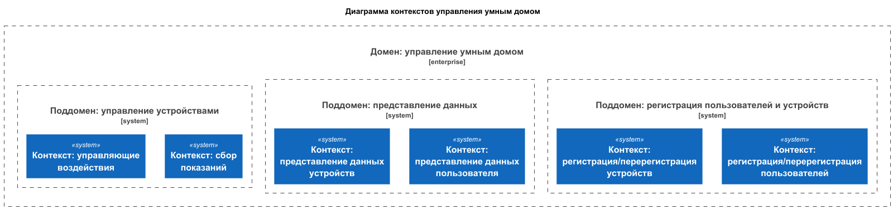
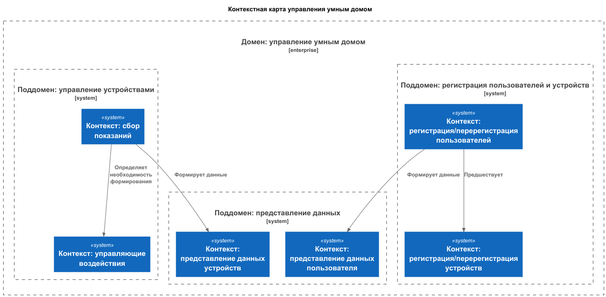
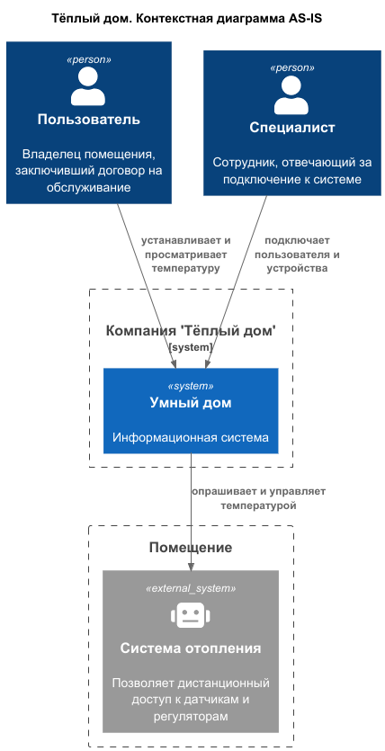
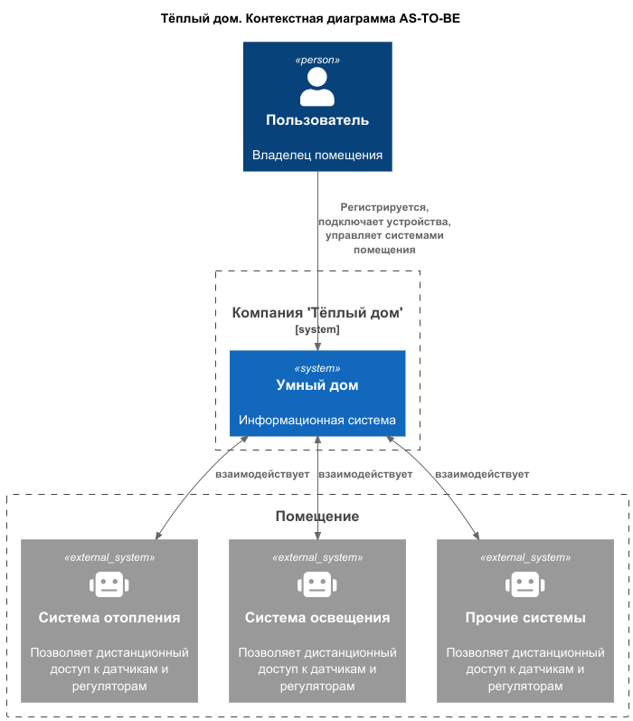
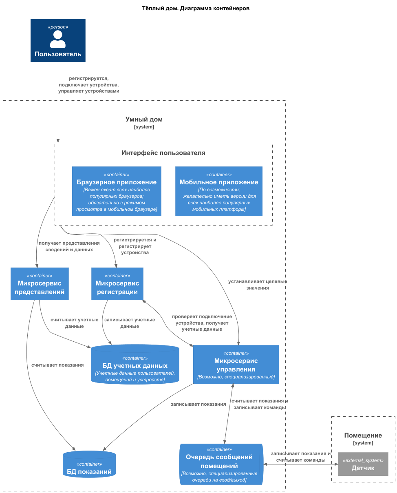
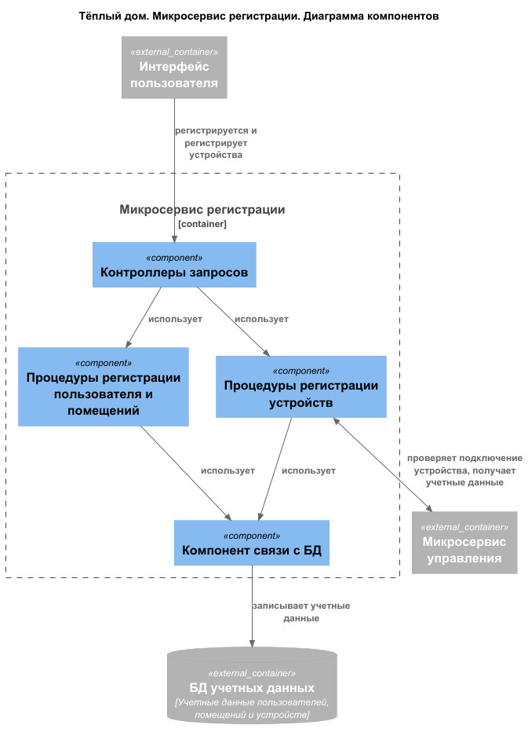
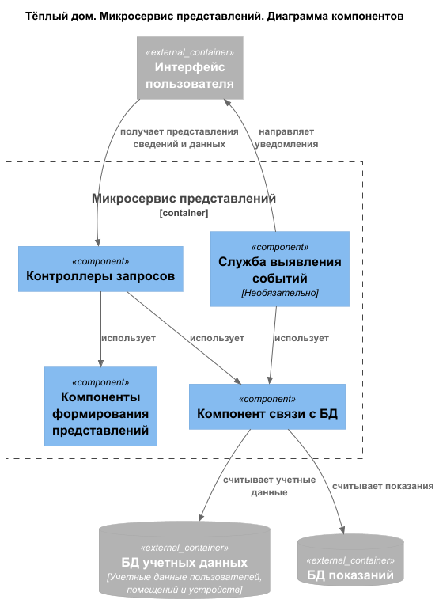
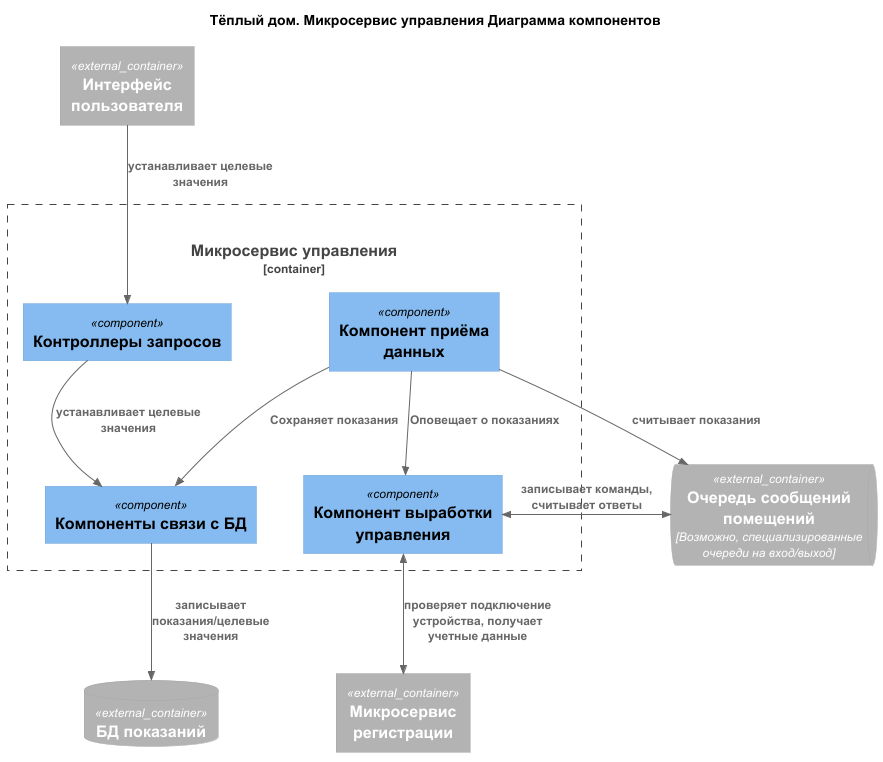
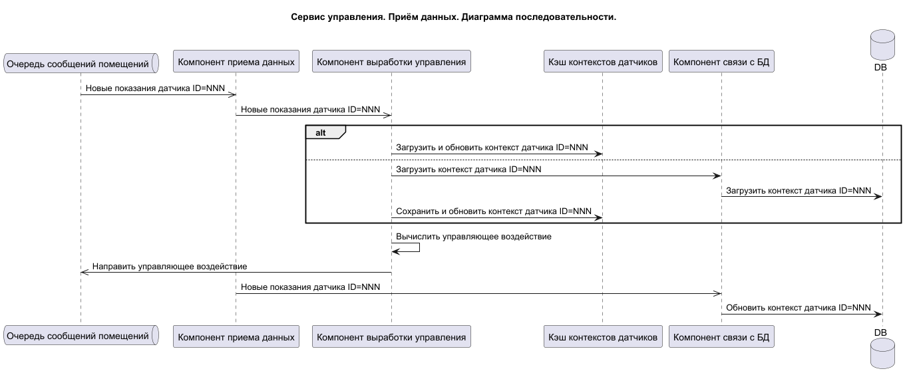
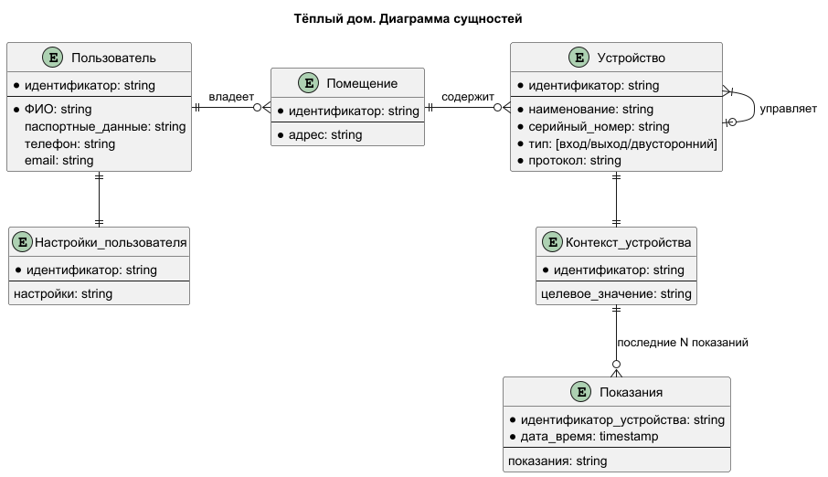

# Спринт 1. "Тёплый дом"

# Задание 1. Анализ и планирование

### 1. Описание функциональности монолитного приложения

**Функции управления подключением (для сотрудника, выезжающего оформлять подключение)**
- Система поддерживает:
  - Средства регистрации пользователей и устройств;
  - Средства диагностики подключения устройств;

Самостоятельно подключить свой датчик к системе пользователь не может

**Управление отоплением:**

- Пользователи могут устанавливать желаемую температуру в принадлежащих им помещениях;
- Система поддерживает: 
  - долговременное хранение желательных температур пользователей; 
  - управление регуляторами отопления с учетом выставленной желательной температуры; 

**Мониторинг температуры:**

- Пользователи могут просматривать текущую температуру в принадлежащих им помещениях;
- Система поддерживает
  - долгосрочное хранение последних показаний датчиков температуры и времени их поступления; 
  - периодическое обновление показателей температуры (запросом от системы к датчику, но не наоборот);

### 2. Анализ архитектуры монолитного приложения

*Архитектура*: монолит  
*Язык реализации*: Go  
*База данных*: PostgreSQL  
*Способы взаимодействия с внешними системами*: только синхронный  
*Масштабируемость*: Вертикальная ограничена возможностями компании; 
    горизонтальная ограничена (из-за монолитной архитектуры), 
    но как временную меру можно рассматривать развертывание отдельных серверов для различных посёлков.  
*Развертывание*: Требует остановки всего приложения. 

### 3. Определение доменов и границы контекстов

В описанной деятельности компании можно выделить один основной домен  

**Домен управления умным домом** 
- *Поддомен регистрации пользователей и устройств*
  - контекст регистрации/перерегистрации пользователей;  
    *Основные понятия*: пользователь, учетные данные, идентификатор, регистрация;
  - контекст регистрации/перерегистрации устройств;  
    *Основные понятия*: пользователь, помещение, устройство, учетные данные, идентификатор, регистрация;
- *Поддомен представления данных*
  - контекст представления данных пользователя;  
    *Основные понятия*: пользователь, учётные данные, помещение, представление;
  - контекст представления данных устройств;  
    *Основные понятия*: помещение, устройство, учётные данные, показания, представление;
- *Поддомен управления устройствами* 
  - контекст сбора показаний;  
    *Основные понятия*: устройство, помещение, показания, момент времени, запрос, ответ, канал связи;
  - контекст управляющих воздействий;  
    *Основные понятия*: устройство, помещение, показания, целевое значение, команда, момент времени, запрос, ответ, канал связи;

### **4. Проблемы монолитного решения**

- Текущее решение привязано к одному языку программирования, и сравнительно малораспространенному;
  - это может создать проблемы с наймом нового персонала и его квалификацией, что ограничивает возможности
    по доработке функционала;
  - это может отрицательно сказаться на возможностях доработки приложения из-за ограничений, накладываемых языком 
    и доступными фреймворками/библиотеками;
- Планирующееся добавление обширного нового функционала может повлечь возникновение ошибок в ранее разработанном
  функционале, что замедлит темпы разработки и дополнительно затруднит тестирование;
- Синхронный способ взаимодействия с устройствами ограничивает возможности приложения по одновременному управлению
  большим количеством устройств, что плохо сказывается на возможностях масштабирования системы.

[Диаграмма контекстов (DDD)](diagrams/domain/domain.plantuml)



[Контекстная карта (DDD)](diagrams/domain/context.plantuml)



Имеющиеся проблемы по масштабированию нельзя назвать острыми, так как существует возможность "шардировать" приложение,
выделив по одному независимому серверу на посёлок. Однако у этого решения есть свои минусы, в первую очередь из-за
необходимости держать персонал (для подключения новых пользователей) в разных регионах страны. Такой вариант может
применяться как временная мера до тех пор, пока не будет введена в строй немонолитная версия системы. 

### 5. Визуализация контекста системы — диаграмма С4

[Диаграмма контекста AS-IS (C4)](diagrams/context/warmhouse-as-is.plantuml)



[Диаграмма контекста AS-TO-BE (C4)](diagrams/context/warmhouse-as-to-be.plantuml)



# Задание 2. Проектирование микросервисной архитектуры

[//]: # (В этом задании вам нужно предоставить только диаграммы в модели C4. Мы не просим вас отдельно описывать получившиеся микросервисы и то, как вы определили взаимодействия между компонентами To-Be системы. Если вы правильно подготовите диаграммы C4, они и так это покажут.)

**Диаграмма контейнеров (Containers)**

[Диаграмма контейнеров (C4)](diagrams/container/warmhouse.plantuml)



**Диаграмма компонентов (Components)**

[Диаграмма компонентов. Сервис регистрации (C4)](diagrams/component/warmhouse-registration-service.plantuml)



[Диаграмма компонентов. Сервис представлений (C4)](diagrams/component/warmhouse-presentation-service.plantuml)



[Диаграмма компонентов. Сервис управления (C4)](diagrams/component/warmhouse-control-service.plantuml)



**Диаграмма кода (Code)**

[Диаграмма кода. Сервис управления (C4)](diagrams/code/control-service-sequence.plantuml)



# Задание 3. Разработка ER-диаграммы

[Диаграмма сущностей (ER)](diagrams/entity-relation/warmhouse.plantuml)



# Задание 4. Создание и документирование API

### 1. Тип API

В предложенной архитектуре взаимодействие между микросервисами минимально, поэтому документирован API для внешних взаимодействий.

- Взаимодействие сервиса регистрации с сервисом управления реализуется по REST-API (один эндпойнт, не документировано);
- Взаимодействие с клиентскими приложениями при регистрации использует REST-API (документирован ниже);
- Взаимодействие с устройствами умного дома реализуется асинхронно (документировано ниже). 

### 2. Документация API

[OpenAPI регистрации](api/registration-service.yml)

[AsyncAPI обмена с устройствами](api/control-service.yml)

# Задание 5. Работа с docker и docker-compose

Выполнено

```
Перейдите в apps.

Там находится приложение-монолит для работы с датчиками температуры. В README.md описано как запустить решение.

Вам нужно:

1) сделать простое приложение temperature-api на любом удобном для вас языке программирования, которое при запросе /temperature?location= будет отдавать рандомное значение температуры.

Locations - название комнаты, sensorId - идентификатор названия комнаты


	// If no location is provided, use a default based on sensor ID
	if location == "" {
		switch sensorID {
		case "1":
			location = "Living Room"
		case "2":
			location = "Bedroom"
		case "3":
			location = "Kitchen"
		default:
			location = "Unknown"
		}
	}

	// If no sensor ID is provided, generate one based on location
	if sensorID == "" {
		switch location {
		case "Living Room":
			sensorID = "1"
		case "Bedroom":
			sensorID = "2"
		case "Kitchen":
			sensorID = "3"
		default:
			sensorID = "0"
		}
	}


2) Приложение следует упаковать в Docker и добавить в docker-compose. Порт по умолчанию должен быть 8081

3) Кроме того для smart_home приложения требуется база данных - добавьте в docker-compose файл настройки для запуска postgres с указанием скрипта инициализации ./smart_home/init.sql

Для проверки можно использовать Postman коллекцию smarthome-api.postman_collection.json и вызвать:

- Create Sensor
- Get All Sensors

Должно при каждом вызове отображаться разное значение температуры

Ревьюер будет проверять точно так же.
```

# **Задание 6. Разработка MVP**

Необходимо создать новые микросервисы и обеспечить их интеграции с существующим монолитом для плавного перехода к микросервисной архитектуре. 

### **Что нужно сделать**

1. Создайте новые микросервисы для управления телеметрией и устройствами (с простейшей логикой), которые будут интегрированы с существующим монолитным приложением. Каждый микросервис на своем ООП языке.
2. Обеспечьте взаимодействие между микросервисами и монолитом (при желании с помощью брокера сообщений), чтобы постепенно перенести функциональность из монолита в микросервисы. 

В результате у вас должны быть созданы Dockerfiles и docker-compose для запуска микросервисов. 